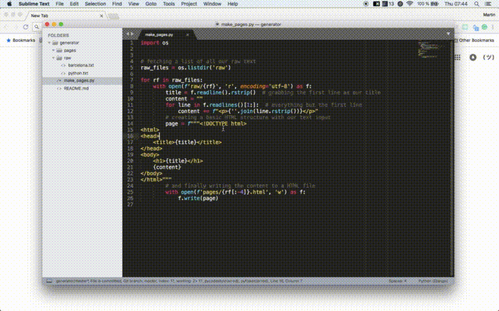

# Static page generator

Let's automate building a travel blog! 🌍🌎🌏

Python is a great choice for automating tedious tasks quickly. In this
project we will write code for an automatic webpage generator.

All you need to do is run `make_pages.py` and any `.txt` document in the `raw`
folder will be converted to a simple HTML page that you can readily host
online e.g. right here on GitHub.

Talk about a simple way to make your own travel blog :)
